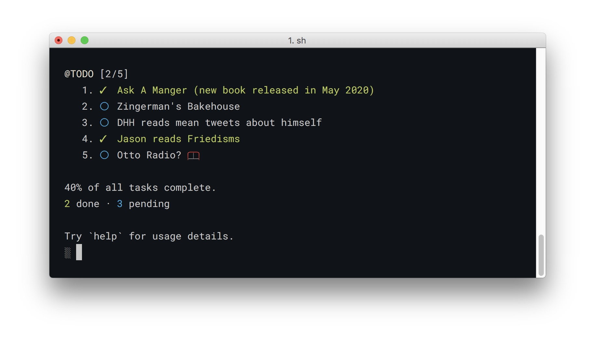

# Todo.sh

A command-line Todo list manager

This directory contains a script, ```Todo.sh```, Running the script after clone

```
$ sh Todo.sh
```



## Note

The database name is ```.Todo.db```. stored at the root of your home folder.